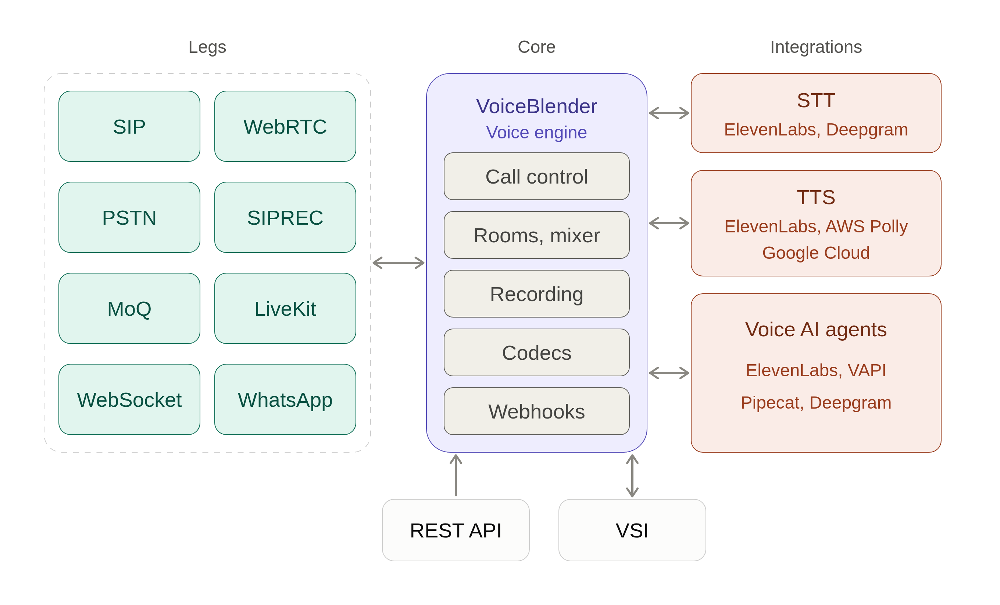

# VoiceBlender

A Go voice engine that connects SIP, WebRTC, WhatsApp, WebSocket and other call legs into mixable rooms, with recording, speech AI integrations, a REST API and real-time events.

[](https://discord.gg/HE9WDMzavN)



## Features

**Legs (call endpoints)**

- **SIP** -- inbound and outbound calls over UDP, TCP and TLS, with digest auth, hold, REFER transfer, early media and session timers
- **SIP trunks & registrations** -- register to upstream PBXs/carriers and act as a registrar for SIP clients
- **Codecs** -- PCMU, PCMA, G.722, Opus, AMR-WB, AMR-NB, with mid-call codec renegotiation
- **WebRTC** -- browser voice via SDP offer/answer with trickle ICE
- **WhatsApp Business Calling** -- inbound and outbound WhatsApp voice calls
- **WebSocket legs** -- raw PCM over WebSocket for bots and custom clients
- **LiveKit** -- bridge a LiveKit room, one leg per remote participant
- **MoQ (experimental)** -- Media-over-QUIC legs over WebTransport
- **SIPREC** -- session recording server and client (RFC 7865 / RFC 7866)
- **Multi-stream SIP calls** -- several audio streams in one call, e.g. original and translated audio

**Media**

- **Rooms** -- multi-party mixing (mixed-minus-self) at 8, 16 or 48 kHz
- **Room bridging** -- connect two rooms with configurable direction
- **Audio routing matrix** -- role-based who-hears-whom for whisper, barge-in and supervisor monitoring
- **Audio filters** -- per-leg denoise, band-pass, gain and voice effects (robotic, vocoder, pitch)
- **Comfort noise** -- optional per-room background noise
- **DTMF & Real-Time Text** -- RFC 4733 telephone-events and T.140 text
- **Recording** -- per-leg, per-room or multi-track WAV with pause/resume and S3/GCS upload
- **Playback** -- WAV/MP3 files and telephone tones

**AI**

- **TTS** -- ElevenLabs, Google Cloud, AWS Polly, Deepgram, Azure, with speculative preflight synthesis
- **STT** -- ElevenLabs, Deepgram, Deepgram Flux, Azure, Speechmatics, with turn detection
- **AI agents** -- ElevenLabs, VAPI, Pipecat, Deepgram, attachable to a leg or a whole room
- **Answering machine detection** -- human / machine classification with beep detection

**Control & observability**

- **REST API** -- full call and room control ([OpenAPI spec](openapi.yaml))
- **Webhooks** -- signed, retried, deduplicated event delivery
- **VSI** -- a single WebSocket for events and commands ([AsyncAPI spec](asyncapi.yaml))
- **Prometheus metrics** -- at `GET /metrics`, plus optional pprof

## Quick Start

```bash
# Build and run
go build -o voiceblender ./cmd/voiceblender
./voiceblender

# Or run directly
go run ./cmd/voiceblender
```

The REST API listens on `:8080` and SIP on `127.0.0.1:5060` by default. All configuration is
via environment variables -- see [CONFIGURATION.md](CONFIGURATION.md) and the ready-to-edit
[voiceblender.env.example](voiceblender.env.example).

To try calls between two instances, bring up the two-node cluster:

```bash
docker compose -f docker/docker-compose.cluster.yml up --build
```

## API Overview

All endpoints live under `/v1`. The table is a map only -- see [API.md](API.md) for requests,
responses and events.

| Area | Endpoints |
|------|-----------|
| Legs | `POST /legs` (originate sip / whatsapp / websocket / livekit_room), `GET /legs`, `GET\|DELETE /legs/{id}` |
| Call control | `/legs/{id}/` `answer`, `ring`, `early-media`, `challenge`, `mute`, `deaf`, `hold`, `transfer/*`, `dtmf`, `rtt` |
| Leg media | `/legs/{id}/` `play`, `tts`, `record`, `stt`, `agent/*`, `amd`, `filters`, `streams/*`, `siprec` |
| Inbound legs | `GET /legs/websocket` (WebSocket), `CONNECT /legs/moq` (WebTransport), `POST /webrtc/offer` |
| Rooms | `POST\|GET /rooms`, `GET\|DELETE /rooms/{id}`, `/rooms/{id}/legs`, `/rooms/{id}/ws` |
| Room media | `/rooms/{id}/` `play`, `tts`, `record`, `stt`, `agent/*`, `siprec` |
| Room topology | `/rooms/{id}/bridges`, `/rooms/{id}/routing`, `PATCH /legs/{id}/role` |
| SIP | `/sip/registrations`, `/sip/registrations/attempts/{id}/*`, `/sip/trunks` |
| Events | `GET /vsi` (WebSocket), webhooks configured globally or per leg / room |

> **Security:** the HTTP API has no built-in authentication. Access is gated only by the
> `ALLOWED_IPS` allowlist and network placement -- put an authenticating reverse proxy in
> front of it before exposing it to untrusted networks.

## Use Cases

- **Voice AI agents** -- put an AI agent on inbound or outbound phone, WhatsApp or browser calls
- **Contact center** -- conferencing, transfers, supervisor whisper / barge-in, recording with PCI pause
- **Outbound dialing** -- answering machine detection, TTS announcements, DTMF menus
- **Call recording & analytics** -- SIPREC recording server with live transcription
- **Live translation** -- separate rooms for the original and translated audio of one call
- **Protocol gateway** -- bridge SIP, WebRTC, WhatsApp, LiveKit and WebSocket participants in one room

## Your First Call

With VoiceBlender running and a SIP endpoint to call, dial it into a room, speak to it,
record it and hang up:

```bash
API=http://localhost:8080/v1
JSON='Content-Type: application/json'

# Create a room and start recording it
curl -X POST $API/rooms -H "$JSON" -d '{"id":"demo"}'
curl -X POST $API/rooms/demo/record -H "$JSON" -d '{}'

# Dial a SIP phone; it joins the room once answered
LEG=$(curl -s -X POST $API/legs -H "$JSON" \
  -d '{"type":"sip","to":"sip:alice@192.168.1.100:5060","room_id":"demo"}' | jq -r .id)

# After it answers, say something (needs ELEVENLABS_API_KEY), then hang up
curl -X POST $API/legs/$LEG/tts -H "$JSON" \
  -d '{"text":"Hello from VoiceBlender","voice":"Rachel","provider":"elevenlabs"}'
curl -X DELETE $API/legs/$LEG
```

Watch the call progress (`leg.ringing`, `leg.connected`, `tts.finished`, `leg.disconnected`, ...)
by setting `WEBHOOK_URL` or connecting a WebSocket client to `ws://localhost:8080/v1/vsi`.

## Networking

| Port | Protocol | Purpose | Setting |
|------|----------|---------|---------|
| 8080 | TCP | REST API, VSI and WebSocket legs | `HTTP_ADDR` |
| 5060 | UDP (+TCP) | SIP | `SIP_PORT`, `SIP_TCP_ENABLED` |
| 5061 | TCP | SIP over TLS, required for WhatsApp (when set) | `SIP_TLS_PORT` |
| 10000-20000 | UDP | RTP media | `RTP_PORT_MIN`, `RTP_PORT_MAX` |
| 8443 | UDP | MoQ / WebTransport (when enabled) | `MOQ_LISTEN_ADDR` |

SIP binds to `127.0.0.1` by default -- set `SIP_BIND_IP` to a reachable address. Behind NAT or
in Docker, set `SIP_EXTERNAL_IP` (SIP/RTP) and `WEBRTC_EXTERNAL_IPS` (WebRTC ICE) to the public
address. See [CONFIGURATION.md](CONFIGURATION.md).

## Typical Workflow

```
1. Configure a webhook        WEBHOOK_URL env var, or per leg / room
2. Receive inbound call       --> webhook: leg.ringing {leg_id, from, to}
3. Answer                     POST /v1/legs/{id}/answer
4. Create a room              POST /v1/rooms
5. Add legs to room           POST /v1/rooms/{id}/legs
6. Attach AI agent            POST /v1/legs/{id}/agent/{provider}
7. Start recording            POST /v1/rooms/{id}/record
8. Hang up                    DELETE /v1/legs/{id}
```

## Documentation

- [API.md](API.md) -- REST API, webhooks and event reference
- [CONFIGURATION.md](CONFIGURATION.md) -- every environment variable
- [TESTING.md](TESTING.md) -- unit, integration and benchmark tests
- [openapi.yaml](openapi.yaml) / [asyncapi.yaml](asyncapi.yaml) -- machine-readable specs
- [voiceblender.org/docs](https://voiceblender.org/docs) -- online documentation

## Examples

| Example | Description |
|---------|-------------|
| [`examples/call_handler.py`](examples/call_handler.py) | Python webhook listener for inbound SIP calls with room conferencing |
| [`examples/webrtc-client/`](examples/webrtc-client/) | Browser-based WebRTC voice client with room management and DTMF |
| [`examples/pipecat-agent/`](examples/pipecat-agent/) | SIP call connected to a self-hosted Pipecat voice bot |
| [`examples/moq-web/`](examples/moq-web/) | Browser MoQ (WebTransport) client |
| [`examples/gen_test_wav.py`](examples/gen_test_wav.py) | Generate test WAV files for playback testing |

## Testing

```bash
go test ./internal/...                                              # unit tests
go test -tags integration -v -timeout 60s ./tests/integration/      # integration tests
```

See [TESTING.md](TESTING.md) for setup and benchmarks.

## Contributing

[CLAUDE.md](CLAUDE.md) is the checklist for every change -- formatting, spec regeneration, docs
and tests. It applies to human contributors and any coding agent alike, not just Claude.
CI runs:

```bash
gofmt -l .
go vet ./...
go test ./internal/... -count=1 -timeout=60s
```

## AI-Assisted Development

This project was developed with the assistance of [Claude Code](https://claude.com/claude-code), Anthropic's AI coding assistant.

## License

See LICENSE file.
